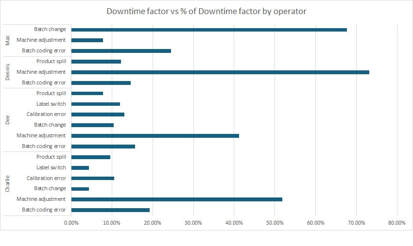

# 🏭 Manufacturing Downtime Analysis

An end-to-end data analysis project using **Power Query** and **Power Pivot** to identify production bottlenecks and optimize operator efficiency.

📂 **Data Source:** [Manufacturing Downtime Dataset by Maven Analytics](https://mavenanalytics.io/guided-projects/manufacturing-downtime-analysis)

---

## 🎯 Project Objective
These are the questions imposed that we can answer
* **Line Efficiency:** Benchmarking performance across different product lines.
* **Downtime Root Causes:** Identifying the "Big Rocks" causing delays.
* **Workforce Performance:** Analyzing downtime by operator and specific error types.

---

## 🛠️ Technical Implementation

### 1. Data Modelling with Power Query and Pivot Table  ⚙️
* Unpivoted the 'line downtime' sheet as it is a matrix to create a normalized data structure with Power Query
* Loaded data into the **Excel Data Model** and established table relationships.
* Created the following calculated measures 
  * Total min =  `[End Time] - [Start Time]`
  * min Product Time =  `[Count of Batch] * [Min Batch Time]`
  * Efficiency_product =   `[Min Product Time] / [Total Min]`

### 3. Visualization 📈
Built a dynamic dashboard featuring:
* **Downtime vs. Factors:** Bar chart identifying major time-wasters.
* **Efficiency vs. Product Line:** Comparative analysis of line performance.
* **Operator Factor %:** Breakdown of downtime causes per employee.

[📂 Download Manufacturing Analysis Excel File](Manufacturing_Line_Productivity.xlsx)
* Please use file > option > advanced > Display option for this workbook : [/] Show sheet tabs to work on this file.

---

## 🔍 Findings based on recommended Analysis 

### ⚡ Line Efficiency : What's the current line efficiency? (total time / min time)?

| Product | Efficiency_product |
| :--- | :--- |
| **LE-600** | 68.05% |
| **DC-600** | 67.61% |
| **CO-600** | 64.56% |
| **RB-600** | 61.95% |
| **OR-600** | 44.44% |
| **CO-2L** | 22.20% |

* **Top Performer:** LE-600 Lemon lime (**68%**) 🏆
* **Underperformer:** CO-2L Cola (**22.2%**) ⚠️

---

### 👤 Operator Performance : Are any operators underperforming?

| Operator | Average of Downtime (min) |
| :--- | :--- |
| **Charlie** | 22.59 |
| **Dee** | 19.47 |
| **Dennis** | 25.17 |
| **Mac** | 25.54 |
| ** Total** | **22.75** |

* **Average Downtime:** 22.75 min
* **Above Average (Underperforming):** **Mac** (25.54 min) , **Dennis** (25.17)

---

### 🛠️ Leading Downtime Factors : What are the leading factors for downtime?

| Row Labels | Sum of Downtime (min) |
| :--- | :--- |
| Machine adjustment | 332 |
| Machine failure | 254 |
| Inventory shortage | 225 |
| Batch change | 160 |
| Batch coding error | 145 |
| Other | 74 |
| Product spill | 57 |
| Calibration error | 49 |
| Labeling error | 42 |
| Label switch | 33 |
| Conveyor belt jam | 17 |
| Grand Total | 1388 |

* **Major Bottleneck:** **Machine Adjustment** (Total: 332 minutes).

---

### 🚩 Operator Error Correlation : Do any operators struggle with particular types of operator error?

| Factor | Struggling Operators |
| :--- | :--- |
| **Machine Adjustment** | Charlie, Dee, Dennis |
| **Batch Change** | Mac |

---

### Recommendation
* According to Pareto Principle, we should prioritize top 80% of downtime factor, which is in top 5 of factors.
* And of this 5 factors, 3 are operators error : Machine adjustment, Batch change, Batch coding error.
* And 3 of operators struggle with machine adjustment, Charlie , Dee , Dennis
* So the recommendation based on this top down approach is to focus on machine adjustment issue.
* We can improve SOP with more clarity , retrain these operators and have supervisor approve machine adjustment work for every batch.
* We should apply this on line with lowest efficiency, CO-2L Cola with 22.2%
* For other downtime factors, we can use quality engineering by assigning RPN to each issue and create PFMEA task force. 
